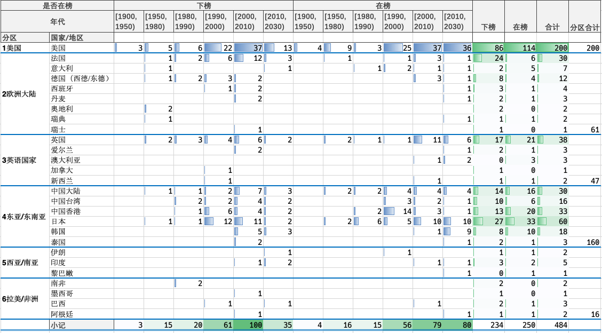
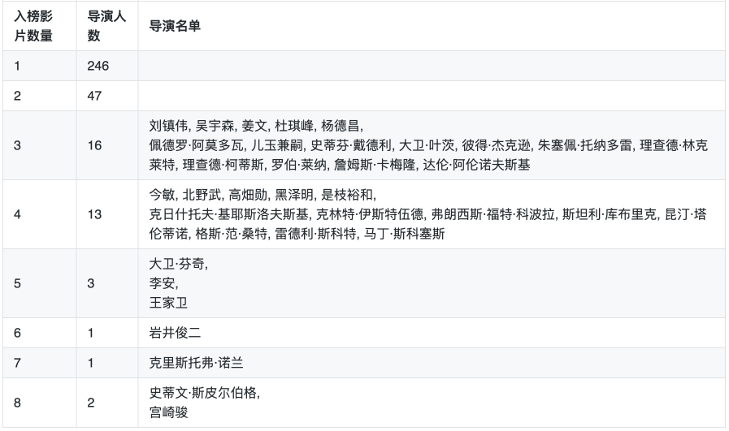
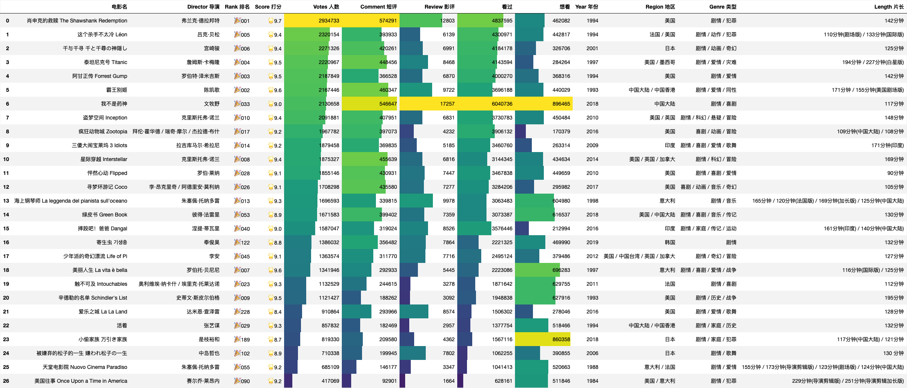
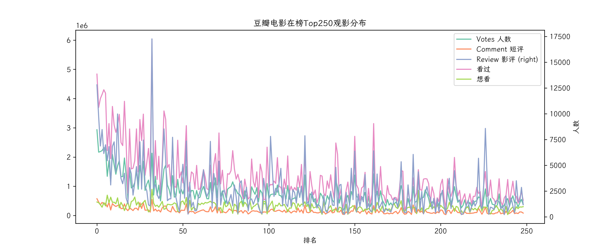
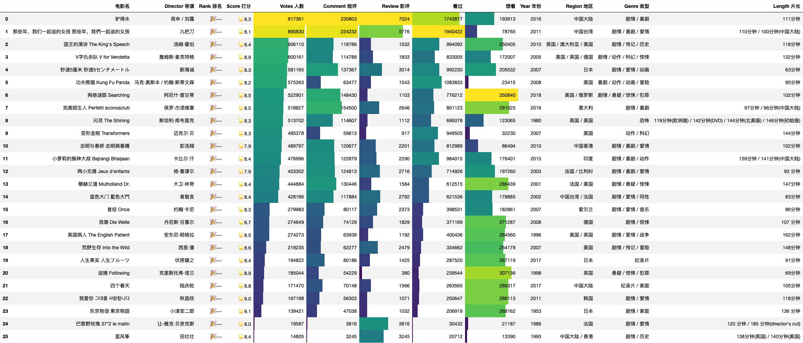
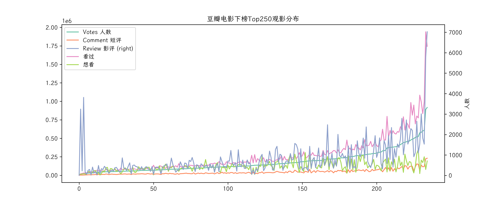

# 豆瓣电影 Top250

## 说明

豆瓣电影 Top250 [链接](https://movie.douban.com/top250/)；

排名可能相关的因素：豆瓣打分值、打分人数、看过（想看）人数、上映时间，以及可能对部分类型和题材的调权。

目前豆瓣电影的排名变化每天都不太明显，仅有少量进出榜单和排名变化。

排序算法一些讨论：

- [豆瓣 250 评分排名算法机制, 月光博客](https://www.williamlong.info/archives/6385.html)
- [浅谈豆瓣 top250 排名机制及各种奇怪的现象解析, 豆瓣-梦幻之都](https://www.douban.com/group/topic/212707785/)

## 豆瓣电影 Top250 分析

数据说明：

仅分析电影目前或曾经在榜电影，去除电视剧和动画剧集（41）、短片（13 部）、其他（《2008 年第 29 届北京奥运会开幕式》），共 484 部电影，其中已经下榜 234 部。

### 相关结果

- 年代和国家（地区）分布：美国遥遥领先，华语片、日语片紧随其后。
  

- 导演：斯皮尔伯格、宫崎骏、诺兰问鼎前三。
  

- 类型分布：剧情片为主，爱情、喜剧类型最多。
  

### 热门影片

- 在榜影片：《肖申克的救赎》、《我不是药神》、《小偷家族》。
  
  

- 下榜影片：《驴得水》、《那些年，我们一起追的女孩》、《网络迷踪》。下榜影片整体相比在榜的热门度都低很多。
  
  
